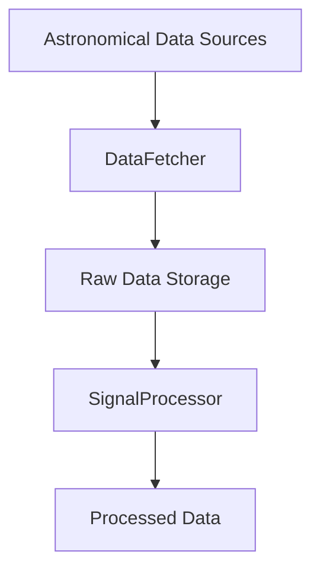

# SETINet: AI-Driven Framework for Extraterrestrial Signal Detection

[](https://discord.gg/agora-999382051935506503) [](https://www.youtube.com/@kyegomez3242) [](https://www.linkedin.com/in/kye-g-38759a207/) [](https://x.com/kyegomezb)


[](https://www.python.org/downloads/release/python-380/)
[](https://pytorch.org/)
[](https://opensource.org/licenses/MIT)
[](https://arxiv.org/abs/)

## Overview

SETINet is a state-of-the-art framework for analyzing astronomical data to detect potential technosignatures of extraterrestrial intelligence. This project implements a deep learning approach to process and analyze radio telescope data, utilizing convolutional neural networks optimized for signal detection in spectral data.

## Key Features

- 🔭 Automated data collection from multiple radio telescope sources
- 🤖 Deep learning-based signal detection and classification
- 📊 Real-time data processing and analysis pipeline
- 📈 Comprehensive visualization and monitoring tools
- 🔍 Advanced signal processing and noise reduction
- 💾 Efficient data management and model checkpointing

## System Architecture

### Data Pipeline


### Model Architecture

The SETINet model employs a deep convolutional neural network architecture optimized for spectral data analysis:

```
Input Layer (1 x 1024 x 1024)
    │
    ▼
Conv2D(32) + ReLU + MaxPool
    │
    ▼
Conv2D(64) + ReLU + MaxPool
    │
    ▼
Conv2D(128) + ReLU + MaxPool
    │
    ▼
Flatten
    │
    ▼
Dense(512) + ReLU
    │
    ▼
Dropout(0.5)
    │
    ▼
Output Layer (2)
```

## Installation

### Prerequisites

- Python 3.8+
- CUDA-capable GPU (recommended)
- 16GB+ RAM

### Setup

1. Clone the repository:
```bash
git clone https://github.com/Agora-Lab-AI/SETINet.git
cd SETINet
```

2. Create and activate a virtual environment:
```bash
python -m venv venv
source venv/bin/activate  # On Windows: venv\Scripts\activate
```

3. Install dependencies:
```bash
pip install -r requirements.txt
```

## Usage

```bash
python main.py
```

## Contributing

We welcome contributions! Please see our [CONTRIBUTING.md](CONTRIBUTING.md) for guidelines.


## Citation

If you use SETINet in your research, please cite our paper:

```bibtex
@article{setinet2024,
  title={SETINet: Deep Learning Framework for Extraterrestrial Signal Detection},
  author={Kye Gomez},
  journal={arXiv preprint arXiv:2024.xxxxx},
  year={2024}
}
```

## License

This project is licensed under the MIT License - see the [LICENSE](LICENSE) file for details.

## Acknowledgments

- Breakthrough Listen Initiative for providing open-source data
- Green Bank Observatory for radio telescope data access
- The SETI research community for valuable feedback and contributions

## ## 📬 Contact

- 🌐 Website: https://agoralab.ai
- 🐦 Twitter: [@AgoraLabAI](https://twitter.com/AgoraLabAI)
- Twitter: [@kyegomez](https://twitter.com/kyegomez)
- Email: kye@swarms.world

---

## Want Real-Time Assistance?

[Book a call with here for real-time assistance:](https://cal.com/swarms/swarms-onboarding-session)

---

⭐ Star us on GitHub if this project helped you!
